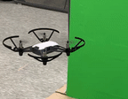

# A 리그 Math꺼워 팀 코드 설명서 

[대한전기학회](http://www.kiee.or.kr/), [Mathworks Korea](https://kr.mathworks.com/), [광운대학교](https://www.kw.ac.kr/ko/) 가 공동 주최한 
[__2020 미니드론 자율주행 경진대회__ ](https://www.facebook.com/ImDrone) 리그 A 에 참가한 MATH 꺼워 팀의 최종 코드 설명문입니다. 

## 목차

1. 텔로 드론 소개 
2. 주행 알고리즘 
3. 중심링 찾기 알고리즘 
4. 주행 알고리즘 문제 해결 과정
5. 최종 주행 알고리즘 설명 
6. yaw 제어 문제 해결 
7. 팀원 소개


## 1. 텔로 드론 소개 


[](https://www.ryzerobotics.com/kr/tello)

[MATLAB Tello Support 패키지](https://kr.mathworks.com/hardware-support/tello-drone-matlab.html) 를 이용해 TELLO 미니드론 코딩을 진행했습니다. 


## 2. 주행 알고리즘 

코스에 따른 최종 주행 알고리즘은 다음과 같습니다. 


대회 준비를 위해 경기장과 유사한 트랙을 만들어서 주행 연습을 진행했습니다. 


## 3. 중심링 찾기 알고리즘 


멀리서 드론 주행 방향을 맞추기 위해 우선 초록색 링의 중심을 찾았습니다. 

이미지를 받아오고 이 중 초록색 성분만 필터링해 이미지의 특성을 찾아주는 매트랩 함수인 ```regionprops``` 에 넣었습니다. 
이때 초록색 링의 구멍을 찾기 위해 필터링한 초록성분을 ```imcomplement``` 에 넣어 반전시켰습니다. 

   ```Matlab
   R = img(:,:,1);
   G = img(:,:,2);
   B = img(:,:,3);
   justGreen = G - R/2 - B/2;
   bw = justGreen > 40; 
   bw2 =imcomplement(bw); 
   props = regionprops(bw2,'Image','BoundingBox','Centroid','Area');
   ```

단순히 regionprops 만 하면


이와 같이 여러 개의 초록 성분이 검출됩니다. 이 중에서 저희가 원하는 박스만을 검출하기 위해 regionprops 요소 개수만큼 for 문을 돌렸습니다. 


```Matlab
if length (props)==1
             miss_green=1;
           
            elseif length (props)>1 
             A= zeros(length (props));
                for j=1:length (props)
                  A(j)=props(j).Area;
                end
             B = sort(A,'descend');
             for j=1:length (props)
                if B(2)==props(j).Area
                    max2=j;
                end
                if B(1)==props(j).Area
                    max=j;
                end
             end
             
             bbbb1=props(max).BoundingBox;
                 if(bbbb1(3)==960 || bbbb1(4)==720 )
                    max=max2; 
                 end
             green_box=props(max).BoundingBox; 
             
```             


A 라는 영행렬을 만들어 준 후 props 요소를 A 에 추가해 주고,  
A 행렬을 크기 순서대로 순서대로 재배열 ```sort``` 한 B 라는 행렬을 새로 만들어 줬습니다. 


이때 


이런 경우, B 에는 캔버스 자체가 들어가므로 (가장 큰 초록 네모 = 화면 전체) ```max2``` 라는 새 변수를 만들어 줘서 이때는 B(2)번째 요소를 사용할 수 있도록 했습니다. 

## 4. 주행 알고리즘 설계 과정  

초기에는 PID 제어를 하려 했으나, __텔로 드론의 최소이동거리가  20 cm__ 라서 연속적으로 모터를 제어하는 것은 근본적으로 한계가 있었습니다. 


그래서 이와 같이 화면을 섹션별로 나누어서 링의 중심이 어느 섹션에 있느냐에 따라 모터를 제어하기 시작했습니다. 

```Matlab
if section==1
            moveup(drone,'Distance',len,'WaitUntilDone',false);
            pause(2);
            moveleft(drone,'Distance',len,'WaitUntilDone',false);
            pause(2);  
            .
            .
            .
```


###  이동 최소 거리 20 cm 의 난관

***

하지만 링에 점점 가까이 가면서 


< 드론이 보는 화면 > 


이와 같이 링의 일부분만 보일 때 regionprops 의 ```Cetroid``` 와 링의 중심이 일치하지 않는 일이 발생했습니다. 
또한, 드론의 최소 이동거리가 20cm 라는 것도 주행 알고리즘 설계에서 가장 어려웠던 부분 중 하나였습니다. 


드론이 링과 멀리 떨어져 있을 때에는 20cm 제약이 큰 문제가 되지 않았는데, 드론이 링과 가까워지면서 링이 가운데 섹션에 들어가지 못하고 __무한 루프에 빠져 왔다갔다__ 하는 현상이 발생했습니다. 

이 두 문제 모두 드론이 링에 가까워지면서 생기는 문제였으므로, 저희는 __링과의 거리에 따라 드론 제어 알고리즘을 다르게 설계__ 했습니다. 


또한, 이처럼 드론 카메라 자체가 약간 기울어지게 달려 있어서 화면의 중심과 드론 주행의 중심이 일치하지 않는다는 문제도 있었습니다. 


### 주행 알고리즘 문제 해결 _ 1차 시도 

***

그래서 저희는 마크를 탐지하기 위해 매트랩 빌트인 함수인 imfindcircles 를 사용했습니다. 


> imfindcircles : 원형 허프 변환(Circular Hough Transform)을 사용하여 원 찾기
> [centers,radii] = imfindcircles(A,radiusRange)는 radiusRange로 지정된 범위의 반지름을 갖는 원을 찾습니다. 추가 출력 인수 radii는 centers의 각 원의 중심에 대응하는 반지름 추정값을 포함합니다.


```Matlab
[center_red,radii_red] = imfindcircles(bwred,[6 20],'ObjectPolarity','bright', ...
'Sensitivity',0.9,'Method','twostage');  
```

그리고 찾은 원의 반지름을 ```radii_red``` 라는 변수에 저장했습니다. 


대회용 직경 2.5cm 원 기준으로 radii_red  값은 다음과 같이 변화합니다. 

그래서 circle 이 감지 되기 전, 
즉 링으로부터 드론이 충분히 떨어져 있어 드론의 20cm 이동이 화면 픽셀에서 큰 비중을 차지하지 않을 때는 기존의 section 별 주행 알고리즘을 쓰고 
radii_red 가 6 이상일 때부터 20cm 라는 주행 한계에 최적화된 알고리즘을 짜려고 했습니다. 


그래서 이와 같이 
링을 통과할 수 있을 정도의 범위내에 드론이 위치해 있을 때 
드론의 중심이 화면에 있는 범위를 측정했습니다. 


다음과 같이 링에서 40cm 기준으로 20cm 이동할 때마다 평균적으로 가로는 110, 세로는 60 픽셀 정도 이동했습니다. 


### radii_red 가 7 이상일 때 

***


위 사진과 같이, 원의 중심이 박스 내에 들어오도록 했고 이 박스의 크기는 드론과 링 사이의 거리에 따라서 달라집니다. 

```Matlab 
   if center_red(1)<420   % 480 200  100
             moveleft(drone,'Distance',0.2,'WaitUntilDone',false);
             disp('red_left');
             pause(2);
             .
             .
             .
``` 


### 주행 알고리즘 문제 해결_ 2차시도: 너무 느려...

***


이런 식으로 한 번 갈 때마다 중심을 맞춰 줬더니, 드론의 이동 속도가 너무 느려서 답답했습니다. 


그래서 한번 맞추면 앞으로 대폭 전진하는 just_go 알고리즘을 만들었습니다. 

```Matlab 
if mode ==1 && section==52&&green_match==0 &&green_match_first==1 % 착륙하고 나서 바로 초록색 링을 보고 중심을 맞추고 

           mode2_control_done=1;
           green_match=1;
           green_match_first=0;
           disp('mode1 green_match');

       end
       
if mode==1&& green_match==1

           mode2_control_done=0;
           
           if ~isempty (center_red)&&red_close>5 && bb(1)< center_red(1)&&center_red(1)<bb(1)+bb(3) && bb(2)< center_red(2)&&center_red(2)<bb(2)+bb(4) &&stage_check<3
            mode2_control_done=0;
            green_match=0;
            mode=2;
            disp('mode2 start');
           elseif ~isempty (center_blue)&&blue_close>5 && bb(1)< center_blue(1)&&center_blue(1)<bb(1)+bb(3) && bb(2)< center_blue(2)&&center_blue(2)<bb(2)+bb(4) &&stage_check>2
            mode2_control_done=0;
            green_match=0;
            mode=3;
            disp('mode3 start');            
           else
               moveforward(drone,'Distance',0.45);
               disp('mode1 just go fast'); 
          end
       end
``` 

코드의 이 부분을 보면 mode=1 에서 한 번 ```green_match``` ( = 초록 링의 중심이 화면의 중앙에 들어왔어 ! ) 가 뜨면 빨간 원을 찾을 때 까지 그대로 직진하게 됩니다. 


하지만 여러 요인 때문에 빨간 원을 못 찾을 경우, 바로 직진하기 때문에 너무 리스크가 크다고 판단했습니다. 


## 5. 주행알고리즘_최종


이론적으로는 한 번만 중심 맞추고 앞으로 가 ! 하면 될 것 같았지만 기기 자체의 부정확함과 다양한 주행 환경 때문에 __가다가 옆으로 새는 일__ 이 빈번하게 발생했습니다. 


*(직진하라고 했는데 왜 옆으로 가지..?)*

그래서 계속 맞추면서 가는 알고리즘을 사용하되 더 빨리 달릴 수 있도록 보완했습니다. 

기존의 '계속 중심을 맞추면서 달린다' 라는 기조를 유지하되 중심을 더 빨리 맞출 수 있도록 박스의 크기를 키웠고, 또 너무 키우면 주행이 불안정해지기 때문에 
여러 차례 시범 주행을 하며 최적의 박스 크기를 찾았습니다. 


```Matlab
fix_center= [480 210];                                         
        if stage_check==1      
               if green_x_length <400
                  x_d=83;
                  y_d=70;
               elseif green_x_length <450   
                  x_d=85;
                  y_d=72;
               elseif green_x_length <500   
                  x_d=87;
                  y_d=74;
               elseif green_x_length <600   
                  x_d=89;
                  y_d=78;
               else
                  x_d=87;
                  y_d=83;
               end
               .
               .
               .
```


거리에 따른 ```green_x_length``` 를 측정한 후, ```x_d```, ```y_d``` 를 달리 해 주었습니다. 
링과의 거리에 따라 fix_center 의 y 값을 적절히 낮춰 줌으로써 카메라 기울어짐 문제도 해결했습니다.  


### 혹시 모를 에러에 대비: dillema_count 도입

***


```green_match``` (초록링의 중심이 화면 중앙에 들어옴) 가 뜰 때 까지 이동하는 드론이, 대회장에서 계속 green_match 를 띄우지 못하고 계속 상하좌우로 이동하는 경우에 대비해
```dillema_count``` 라는 변수를 만들었습니다. 

```Matlab
if center_green(1)<fix_center(1)-x_d
          moveleft(drone,'Distance',0.2,'WaitUntilDone',false);
          disp('green_left');
          dilemma_count=dilemma_count+1;
          pause(2.5);
```

```Matlab
 if dilemma_count>6 && green_match_first==0
            dilemma_count=0;
             disp('dilemma_count_green_match');
            green_match=1;
        end
```

이와 같은 코드를 통해, 7번 이상 상하좌우로 이동했을 경우 '드론이 걸려있다' 라고 판단하여 바로 green_match 를 띄우고 앞으로 전진하도록 했습니다. 


### 초록색 링이 안 보인다? -> green_is_empty

***

링을 보다 빠르게 통과하기 위해 중심을 맞추는 시간을 줄이고자, ```green_is_empty``` 라는 변수를 새로 도입했습니다. 


```Matlab
if mode==2 || mode ==3
    if bw(720-green_a,960-green_a)==0&&bw(720-green_a,green_a)==0&&bw(green_a,960-green_a)==0&&bw(green_a,green_a)==0 && ~isempty (bw)
                      disp('now green is empty!!!!!!!!!!!!!!!!!!!!!!!!!!1');
                      green_empty=1;
    end
``` 
 
mode_2 이상이면 드론이 링에 충분히 가까이 접근 했을 때 입니다. 
이때 초록색이 하나도 없을 경우, 드론이 링을 통과할 정도로 구멍 안에 있다고 판단하여 바로 직진하도록 했습니다.


### 링 밖에서 빨간색을 감지할 때 

***


시범 주행을 해 보는 중에 링 밖의 빨간색을 감지해서 에러가 나는 경우가 종종 있었습니다. 

이를 방지하기 위해 다음과 같이, ```center_red``` (마크의 중심) 가 ```green_box``` (초록링) 내부에 있을 때만 작동하도록 if 문에 조건을 추가했습니다. 


```Matlab 
if ~isempty (center_red)&&red_close>5 && green_box(1)< center_red(1)&&center_red(1)<green_box(1)+green_box(3) && green_box(2)< center_red(2)&&center_red(2)<green_box(2)+green_box(4) &&stage_check<3
            mode=2;
            disp('mode2 start');
            moveforward(drone,'Distance',0.4,'WaitUntilDone',false);
            mode_control_done=21;
            red_close=6;

``` 


## 최종 주행 영상

다음과 같이 무리없이 시범 코스를 완주하는 것을 볼 수 있습니다. 


[완주영상](https://youtu.be/PcTENPAtcsg)


## 6. YAW 제어 문제 

드론 주행에서 yaw 제어는 아주 중요합니다. 


이와 같이, yaw 값의 작은 부정확함이 큰 오차를 낳기 때문입니다. 이론적으로만 생각하면 

전진 -> 90도 회전 -> 전진 

코스에서 yaw 값이 틀어질 일이 없을 것 같지만, 

1. 처음에 놓을 때 부정확하게 놓을 경우
2. 드론 자체 정밀도의 부재로 90도 회전을 명령했는데 정확히 돌지 않을 경우

등의 경우에 yaw 값이 틀어질 우려가 있었습니다. 


### 1차 시도_readOrientation 사용하기 

***

yaw 값을 맞추기 위해 우선 매트랩 내장 함수인 ```readOrientation``` 을 사용했었습니다. readOrientation 은 

```Matlab
drone=ryze();
```
를 통해 드론 객체가 생성될 때 드론의 포지셔닝을 기준으로 드론의 Euler Angle 을 반환합니다. 

이를 사용해서 드론이 예정된 각도를 벗어났을 때 조정해주는 코드를 작성했습니다. 

```Matlab
[angles,time]= readOrientation(drone);
 pause(2);
disp(angles);
if ~isempty(angles)
if angles(1) >0.0174
    disp('turn left');
    turn(drone,deg2rad(-3));
elseif angles(1) < -0.0174
    disp('turn right');
    turn(drone,deg2rad(3));
else
    disp('angle correct_1');
    break;
end
end
```

하지만 readOrientation 같이 드론의 자체 센서를 이용하는 것은 드론 기기에 너무 큰 무리가 갔는지, 이 코드를 넣자 드론 주행은 물론이고 호버링까지 불안정해졌습니다. 이후 이 코드를 전부 제거하니 주행이 안정되어, 드론 주행 코드는 이미지만 가지고 하자고 결심했습니다. 


### 2차 시도_링 아래쪽 꼭짓점의 y 좌표 차이값 사용하기 

***


이와 같이 드론의 yaw 가 틀어져 있으면 초록색 링의 아래쪽 꼭짓점 좌표의 y 값이 크게 차이가 나게 됩니다. 이 차이가 줄어들 때 까지 회전하도록 하면 readOrientation 을 쓰지 않고도 드론의 yaw 를 조절할 수 있을 것이라고 생각했습니다. 


이와 같은 여러가지 경우에서도 예외없이 아래쪽 꼭짓점을 찾는 알고리즘을 찾았습니다. 
일단 픽셀 단위로 for 문을 돌리기 위해 regionprops 의 image 요소를 사용해 사진을 잘랐습니다. 


>regionprops: Image -> 영역의 경계 상자와 크기가 같은 영상으로, 이진(logical형) 배열로 반환됩니다. on 픽셀은 영역에 해당하고, 그 외 모든 픽셀은 off입니다.


for 문은 최종적으로 image_2 에서 돌렸습니다. 


기울기 1인 대각선이 흰색 부분과 처음 만나는 지점이 아래꼭짓점이므로 아래와 같은 코드를 통해 점을 찾았습니다. 


```Matlab
for j= 1:width/2
        yaw_y_left= height-j+1;
        yaw_x_left= 1 ;
        while(1)
          find_yaw_left=0;
              if image_2(yaw_y_left,yaw_x_left) ==1
                  find_yaw_left=1;
                break;
              elseif yaw_y_left ==height && yaw_x_left==j
                break;   
              end
          yaw_y_left=yaw_y_left+1;
          yaw_x_left=yaw_x_left+1;
        end
               if find_yaw_left==1
                break;
               end
    end
    
    for j= 1:width/2
        yaw_y_right= height-j+1;
        yaw_x_right= width ;
        while(1)
          find_yaw_right=0;
              if image_2(yaw_y_right,yaw_x_right) ==1
                  find_yaw_right=1;
                break;
              elseif yaw_y_right ==height && yaw_x_right==width-j+1
                break;   
              end
          yaw_y_right=yaw_y_right+1;
          yaw_x_right=yaw_x_right-1;
        end
               if find_yaw_right==1
                break;
               end
    end

```

이후 여기서 찾은  ```yaw_right```, ```yaw_left``` 값을 ```BoundingBox (3)``` 와 더합니다. 


```Matlab
    final_left(1)=x_1+x_2+yaw_x_left;
    final_left(2)=y_1+y_2+yaw_y_left;

    final_right(1)=x_1+x_2+yaw_x_right;
    final_right(2)=y_1+y_2+yaw_y_right;
```

이후 y 좌표값의 차이가 일정 수준 이하가 될 때까지 돌도록 했습니다. 

```Matlab
 if mode ==1 && green_match==1 &&green_match_first==1
        jk= sprintf("yaw          %d %d",final_left(2),final_right(2));
        disp(jk);
        if final_left(2) - final_right(2) >2
            turn(drone,deg2rad(-3));
            %mode_control_done=0;   이걸 넣어야 하나 말아야 하나 해보자 
            continue;
        elseif final_left(2) - final_right(2) < -2
            turn(drone,deg2rad(3));
            %mode_control_done=0;
            continue;
        else
                if final_left(2) - final_right(2)==0
                    green_match_first_yaw=1;
                    disp('yaw is correct!')
                elseif final_left(2) - final_right(2)>0                   
                    turn(drone,deg2rad(-3));
                    green_match_first_yaw=1;
                    disp('yaw is correct!')
                    
                elseif final_left(2) - final_right(2)<0
                    turn(drone,deg2rad(3));
                    green_match_first_yaw=1;
                    disp('yaw is correct!')
                end
        end
    end
```




 이와 같이 yaw 값을 잘 맞추는 것을 볼 수 있습니다. 


## 팀원 소개

[경희대학교 전자공학과](http://ee.khu.ac.kr/) 소속

| 직책 |  이름 |
|---|:---:|
| __팀장__ | [전지아](https://github.com/jiah-jeon) |
| __팀원__ | [박지원](https://github.com/zzziito) | 
 
