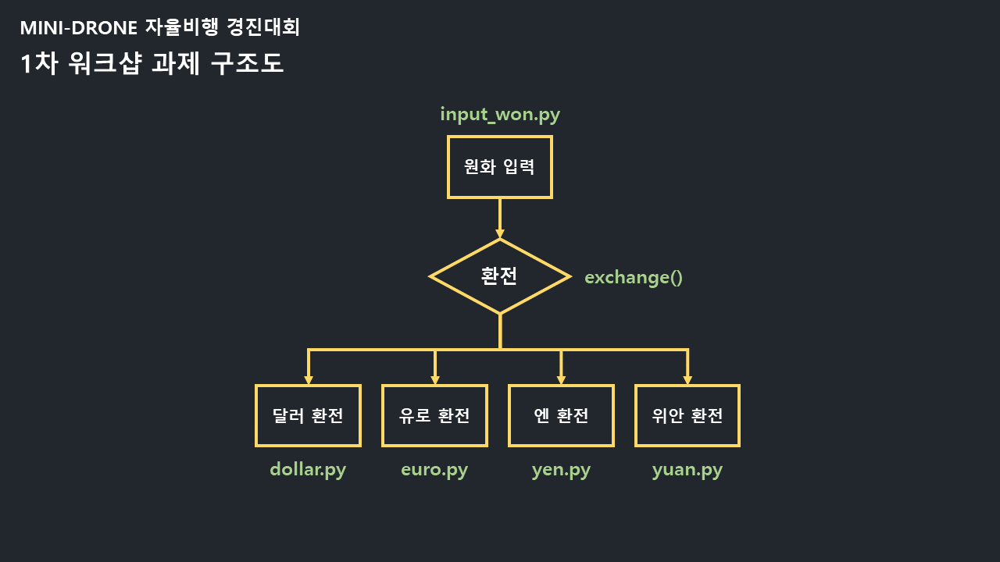

# DroneLeft

* 1차 워크샵 과제



# 🧾 드론좌 전략 🧾
+ HSV 색공간을 이용해 주변 환경 변화로 인한 오류 줄이기
+ 팽창/이진화를 통한 이미지의 노이즈 제거
+ 링의 중앙값을 찾고 드론을 최대한 중앙에 맞추기
+ 링의 지름을 이용한 거리 검출 알고리즘

------------------------------------------------------

## ✅ 드론좌 흐름도


------------------------------------------------------

## ✅ 주요 알고리즘

### 1. 링 검출
+ 링을 촬영한 frame 이미지를 이진화 시킨 후 지정한 값으로 연결성분 제거
+ 이미지 팽창을 통한 빈 공간 보충 
+ 'holes'를 인식한 이미지를 이용해 링 검출

### 2. 링 중심 좌표 검출
+ 검출된 링의 행렬값을 통한 중앙값 추출
+ 드론의 카메라 프레임의 중심값 링의 중심값의 차이를 이용해 드론의 상하좌우를 조정

### 3. 링과의 거리 측정
+ 거리별로 측정한 원의 넓이를 통한 거리 측정 
##

# 4. 표식 검출
+ 두 표식의 hsv 색공간을 이용해 hsv 임계값 추출
+ 추출된 임계값을 이용해 표식 인식 후 다음 단계/착지 결정

------------------------------------------------------

## ✅ 전체 소스 코드에 대한 설명
```matlab
코드
```
