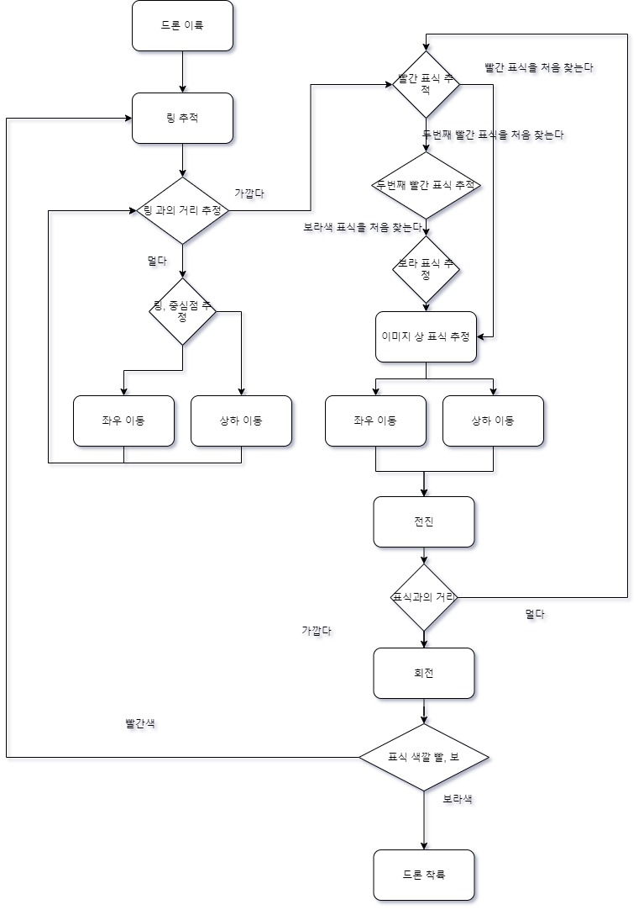
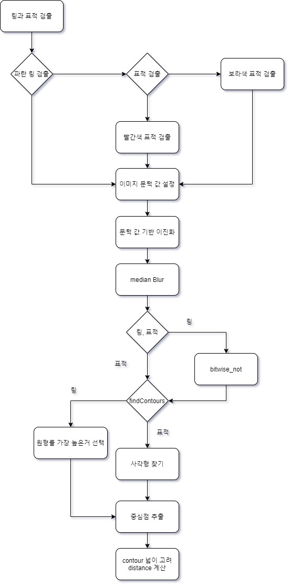

# UOS_Robot 자율비행

> ## 1. 대회 진행 전략
>
> > * ### 영상처리
> >
> >   카메라를 통해 얻은 640 X 480 크기의 이미지를 BGR 색공간에서 HSV 색공간으로 변환
> >
> >   ->  B, G, R의 3가지 색상 변수로 색을 구분하는 것이 아니라 HSV 색공간에서 H(Hue, 색상)의 단일 변수를 통해 색을 구분
> >
> >   ->  HSV 색공간에서 S(Saturation, 채도), V(Value, 명도)의 변화를 고려하지 않는 것으로 빛의 간섭에 의한 색상 변화를 보정
> >
> >   **BGR  ->  HSV**
> >   
</img>    </img>

> > *****
> >
> > * ### 영상처리 방법
> >   for문을 사용한 이미지의 가공을 사용하지 않고 OpenCV의 라이브러리를 통한 영상처리 단순화
> >   
> >   ->  RaspberryPi Zero에서 for문을 통해 620 X 480 크기의 이진화 이미지를 처리해 본 결과, OpenCV 라이브러리를 통한 영상처리가 더 빠른 속도를 보임
> > 
> >   ->  OpenCV 라이브러리를 최대한 활용하여 RaspberryPi Zero에서도 실시간 제어가 가능하도록 최대한 단순화
> >
> >   |  | RaspberryPi 3 | RaspberryPi Zero|
> >   | --- | --- | --- |
> >   | Core | 64-bit Quad-Core | 32-bit Single-Core |
> >   | CPU | 1.2 GHz | 1 GHz |
> >   | Memory | 1 GB | 512 MB |
> > *****
> > * ### Ring 추적
> >    통과할 Ring과 표적을 찾는 방법으로 단순히 색의 중심을 찾는 것이 아니라 객체의 윤곽을 확인하고 모멘트를 통해 중심 좌표를 추적
> >
> >   ->  이진화한 이미지에서 OpenCV 라이브러리를 통해 원과 사각형에 대한 윤곽선을 추출
> >
> >   ->  추출된 도형에서 Ring 추적은 원형률을, 표적 추적은 사각형의 면적과 면적 점유율을 비교하여 비율이 가장 큰 도형을 각각 Ring, 표적으로 인식
> > *****
> > * ### 드론 이동
> >   Ring 추적과 표적 추적을 번갈아가며 드론을 이동하여 통과 확률을 높임
> >
> >   ->  Ring의 중심점과 드론의 위치를 맞추어가며 Ring의 앞까지 이동
> >
> >   ->  표적이 일정 크기 이상으로 보이면 표적의 중심점과 드론의 위치를 맞추어가며 Ring을 통과하고 표적에 맞는 동작 실행
> *****
>
> ## 2. 제어 알고리즘
>
> > * ### 제어 순서도
> > 
> >
</img>

> > 
> > *****
> > * ### 영상처리 순서도
> >
</img>

> *****
>
> ## 3. 코드 설명
>
> > * ### 사용자 정의 함수
> >   * #### _detect 함수_
> >     * 입력받은 HSV 색공간의 H값을 해당 함수의 색에 해당하는 Threshold를 사용하여 이미지를 이진화 처리
> >     * medianBlur를 사용하여 노이즈를 제거하고 반전하여 Ring-주변, 표적-주변을 구분
> >     * Ring과 표적의 중심을 찾기 위해 findcontour 함수를 사용하여 이진화된 이미지에서 원형 객체를 추출
> >     * 추출된 객체들의 원형률과 면적 점유율을 비교하여 가장 Ring과 표적으로 가정하기 적합한 객체의 모멘트 중심을 연산
> >     * 각 함수의 색에 해당하는 distance 함수를 사용하여 Ring과 표적의 상대적인 거리를 계산
> >     * 다음 동작으로의 변경여부, 해당 객체의 중심점, 객체와의 상대 거리를 반환
> >
> > #### _blue_detect
> > 
> > <pre><code>
> >def _blue_detect(H):
> >    _, bi_H = cv2.threshold(H, blue - 6, 255, cv2.THRESH_BINARY)
> >    _, bi_H_ = cv2.threshold(H, blue + 6, 255, cv2.THRESH_BINARY_INV)
> >    binary = cv2.bitwise_and(bi_H, bi_H_)
> >    binary = cv2.medianBlur(binary, 7)
> >    binary = cv2.bitwise_not(binary)
> >    binary = cv2.medianBlur(binary, 7)
> >        
> >    # get center of ring
> >    _, contours, _ = cv2.findContours(binary, cv2.RETR_TREE, cv2.CHAIN_APPROX_SIMPLE)
> >    circle = []
> >    circularity = 0
> >    max_circularity = 0
> >    max_area = 0
> >    blueDetect = True
> >    _blue_distance = 0
> >    print(type(contours))
> >    if contours is not None:
> >        for con in contours:
> >            perimeter = cv2.arcLength(con, True)
> >            area = cv2.contourArea(con)
> >            if area > 1000:
> >                if perimeter == 0:
> >                    break
> >                circularity = 4 * math.pi * (area / (perimeter * perimeter))
> >                if circularity > max_circularity:
> >                    max_circularity = circularity
> >                    circle = con
> >                    max_area = area
> >
> >            mmt = cv2.moments(circle)
> >            if mmt['m00'] != 0:
> >                cxb = int(mmt['m10']/mmt['m00'])
> >                cyb = int(mmt['m01']/mmt['m00'])
> >            else:
> >                cxb, cyb = 0, 0
> >
> >            _blue_distance = blue_distance(max_area)
> >
> >    if _blue_distance > 100:
> >        blueDetect = True
> >    else:
> >        blueDetect = False
> >
> >    return blueDetect, cxb, cyb, _blue_distance
> > </code></pre>
> > 
> > #### _red_detect
> > 
> > <pre><code>
> >def _red_detect(H):
> >    _, re_H = cv2.threshold(H, red - 6, 255, cv2.THRESH_BINARY)
> >    _, re_H_ = cv2.threshold(H, red + 6, 255, cv2.THRESH_BINARY_INV)
> >    binary2 = cv2.bitwise_and(re_H, re_H_)
> >    binary2 = cv2.medianBlur(binary2, 7)
> >    #binary2 = cv2.bitwise_not(binary2)
> >    binary2 = cv2.medianBlur(binary2, 7)
> >    _redDetect = True
> >    red_dis = 10000
> >    cxr, cyr = 320, 240
> >
> >    # get center of red mark
> >    _, contours, _ = cv2.findContours(binary2, cv2.RETR_TREE, cv2.CHAIN_APPROX_SIMPLE)
> >    circle = []
> >    circularity = 0
> >    max_circularity = 0
> >    max_area = 0
> >    blueDetect = True
> >    _red_distance = 0
> >    print(type(contours))
> >    if contours is not None:
> >        for con in contours:
> >            perimeter = cv2.arcLength(con, True)
> >            area = cv2.contourArea(con)
> >            if area > 1000:
> >                if perimeter == 0:
> >                    break
> >                circularity = 4 * math.pi * (area / (perimeter * perimeter))
> >                if circularity > max_circularity:
> >                    max_circularity = circularity
> >                    circle = con
> >                    max_area = area
> >
> >            mmt = cv2.moments(circle)
> >            if mmt['m00'] != 0:
> >                cxr = int(mmt['m10']/mmt['m00'])
> >                cyr = int(mmt['m01']/mmt['m00'])
> >
> >            _red_distance = red_distance(max_area)
> >
> >    if _red_distance > 100:
> >        redDetect = True
> >    else:
> >        redDetect = False
> >
> >    return redDetect, cxr, cyr, _red_distance
> > </code></pre>
> > 
> > #### _purple_detect
> > 
> > <pre><code>
> >def _purple_detect(H):
> >    _, re_H = cv2.threshold(H, purple - 6, 255, cv2.THRESH_BINARY)
> >    _, re_H_ = cv2.threshold(H, purple + 6, 255, cv2.THRESH_BINARY_INV)
> >    binary2 = cv2.bitwise_and(re_H, re_H_)
> >    binary2 = cv2.medianBlur(binary2, 7)
> >    #binary2 = cv2.bitwise_not(binary2)
> >    binary2 = cv2.medianBlur(binary2, 7)
> >    _redDetect = True
> >    red_dis = 10000
> >    cxp, cyp = 320, 240
> >
> >    # get center of red mark
> >    _, contours, _ = cv2.findContours(binary2, cv2.RETR_TREE, cv2.CHAIN_APPROX_SIMPLE)
> >    circle = []
> >    circularity = 0
> >    max_circularity = 0
> >    max_area = 0
> >    purpleDetect = True
> >    _purple_distance = 0
> >    print(type(contours))
> >    if contours is not None:
> >        for con in contours:
> >            perimeter = cv2.arcLength(con, True)
> >            area = cv2.contourArea(con)
> >            if area > 1000:
> >                if perimeter == 0:
> >                    break
> >                circularity = 4 * math.pi * (area / (perimeter * perimeter))
> >                if circularity > max_circularity:
> >                    max_circularity = circularity
> >                    circle = con
> >                    max_area = area
> >
> >            mmt = cv2.moments(circle)
> >            if mmt['m00'] != 0:
> >                cxp = int(mmt['m10']/mmt['m00'])
> >                cyp = int(mmt['m01']/mmt['m00'])
> >
> >            _purple_distance = purple_distance(max_area)
> >
> >    if _purple_distance > 100:
> >        purpleDetect = True
> >    else:
> >        purpleDetect = False
> >
> >    return purpleDetect, cxp, cyp, _purple_distance
> > </code></pre>
> > 
> >   * #### _distance 함수_
> >     * Ring과 드론의 상대적인 거리 판단을 위해 상수에 Ring 면적의 역수를 곱하여 반환
> >
> > #### blue_distance 
> > 
> > <pre><code>
> > def blue_distance(max_area):
> >     blue_dis = blue_area_threshold / max_area
> >     return blue_dis
> > </code></pre>
> > 
> > #### red_distance
> > 
> > <pre><code>
> > def red_distance(max_area):
> >    red_dis = red_purple_area_threshold / max_area
> >    return red_dis
> > </code></pre>
> > 
> > #### purple_distance
> > 
> > <pre><code>
> >def purple_distance(max_area):
> >    purple_dis = red_purple_area_threshold / max_area
> >    return purple_dis
> > </code></pre>
> > *****
> > * ### 메인 코드 진행
> >   * e_drone, picamera, OpenCV, numpy, time, math 라이브러리를 import
> >   * 제어를 위한 파라미터를 설정
> >   * 드론을 연결, 이륙시키고 입력 이미지의 파라미터 설정
> >   * 카메라의 좌우, 상하 반전 후 HSV 색공간으로 변환 및 H 데이터 출력
> >   * 각 단계의 순서에 맞추어 조건문을 통해 영상처리 및 객체의 중심 좌표 연산
> >   * 중심 좌표와 이미지 중심 영역의 비교를 통해 드론을 제어
> >   * 각 단계에 따라 링의 중심을 따라 링에 근접하게 이동
> >   * 링에 근접시, 표적을 기준으로 표적에 근접하도록 이동 및 표적의 색에 해당하는 동작 수행
> >   * try를 사용하여 에러 발생시, 해당 error를 출력하고 진행중이던 단계에 해당하는 동작을 다시 수행
> > 
> > <pre><code>
> > from e_drone.drone import *
> > from picamera.array import PiRGBArray
> > from picamera import PiCamera
> > import cv2
> > import numpy as np
> > from time import sleep
> > import math
> >
> > time = 0
> >
> > red = 10
> > blue = 105
> > purple = 105
> > icx = 320
> > icy = 240
> >
> >
> > leftboundary = 30
> > rightboundary = 30
> > leftboundary2 = 100
> > rightboundary2 = 100
> > upboundary = 30
> > downboundary = 30
> > count = 0
> > 
> > distance_threshold = 10
> > distance_threshold2 = 10
> > distance_threshold3 = 10
> > 
> > blue_area_threshold = 10000000
> > red_purple_area_threshold = 10000000
> > 
> > blueDetect = False
> > blueDistance = 10000
> > 
> > 
> > redDetect = False
> > redDetect2 = False
> > redDistance = 10000
> > redDistance2 = 10000
> > 
> > purpleDetect = False
> > purpleDistance = 10000
> > 
> > redDetect_end = False
> > redDetect2_end = False
> > purpleDetect_end = False
> >   
> > camera = PiCamera()
> > camera.resolution = (640, 480)
> > camera.framerate = 32
> > rawCapture = PiRGBArray(camera, size=(640, 480))
> > #time.sleep(0.1)
> > 
> > drone = Drone()
> > drone.open()
> > 
> > try:
> >     drone.sendTakeOff()
> >     sleep(5)
> > 
> >     #get Image from drone
> >     for frame in camera.capture_continuous(rawCapture, format='bgr', use_video_port=True):
> > 
> >         print("------------------------------------------------------------------------")
> >         cx, cy = 320, 240
> >         print("time: ", time)
> > 
> >         
> >         image = frame.array
> >         image = cv2.flip(image, 0)
> >         image = cv2.flip(image, 1)
> >         print(image.shape)
> >         
> >         # Convert image to HSV
> >         HSV = cv2.cvtColor(image, cv2.COLOR_BGR2HSV)
> >         H = HSV[:, :, 0]
> > 
> >         # Detecting
> >         print(blueDistance)
> >         if blueDistance < 400:
> >             print("-----red Detecing ...")
> >             redDetect, cx, cy, redDistance = _red_detect(H)
> >         elif blueDistance >= 400:
> >             blueDetect, cx, cy, blueDistance = _blue_detect(H)
> >         if redDetect2_end == True:
> >             purpleDetect, cx, cy, purpleDetect = _purple_detect(H)
> > 
> >         # move drone
> >         done = 0
> >         if cx < icx - leftboundary:
> >             if cx < leftboundary2:
> >                 drone.sendControlPosition(0, 1, 0, 0.5, 0)
> >                 sleep(2)
> >                 print("<----")
> >             else:
> >                 print("<-")
> >                 drone.sendControlPosition(0, 0.1, 0, 0.5, 0, 0)
> >                 sleep(2)
> >             done += 1
> >         elif cx > icx + rightboundary:
> >             if cx > rightboundary2:
> >                 drone.sendControlPosition(0, -1, 0, 0.5, 0, 0)
> >                 sleep(2)
> >                 print("---->")
> >             
> >             else:
> >                 print("->")
> >                 drone.sendControlPosition(0, -0.1, 0, 0.5, 0, 0)
> >                 sleep(2)
> >             done += 1
> > 
> >         if cy < icy - upboundary:
> >             drone.sendControlPosition(0, 0, 0.1, 0.5, 0, 0)
> >             sleep(2)
> >             print("up")
> >             done += 1
> > 
> >         elif cy > icy + downboundary:
> >             drone.sendControlPosition(0, 0, -0.1, 0.5, 0, 0)
> >             sleep(2)
> >             print("down")
> >             done += 1
> >         
> > 
> >         if done > 0:
> >             count = 0
> >         else :
> >             count +=1
> >             print(count)
> > 
> >         if count > 3:
> >             print("done")
> > 
> > 
> >         # Devide phase
> >         if blueDetect == False:
> >             if redDetect == True:
> >                 if redDistance > distance_threshold:
> >                     drone.sendControlPosition(0.5, 0, 0, 0.5, 0, 0)
> >                     sleep(2)
> >                     print("red Distance > distance Threshold")
> >                 else:
> >                     drone.sendControlPosition(0, 0, 0, 0, 90, 10)
> >                     sleep(2)
> >                 
> >                     print("red Detect 2")
> >                     redDetect = False
> >                     redDetect_end = True
> >             
> >             elif redDetect2 == True:
> >                 if redDistance2 > distance_threshold2:
> >                     drone.sendControlPosition(0.5, 0, 0, 0.5, 0, 0)
> >                     sleep(2)
> >                     print("red Distance > distance Threshold")
> >                 else:
> >                     drone.sendControlPosition(0, 0, 0, 0, 90, 10)
> >                     sleep(2)
> >                     print("red Detect 2")
> >                     redDetect2 = False
> >                     redDetect2_end = True
> > 
> >             elif purpleDetect == True:
> >                 if purpleDistance > distance_threshold3:
> >                     drone.sendControlPosition(0.5, 0, 0, 0.5, 0, 0)
> >                     sleep(2)
> >                     print("purple distance > Threshold")
> >                 else:
> >                     drone.sendLanding()
> >                     purpleDetect = False
> >                     purpleDetect_end = True
> >                     print("Landing")
> >                     drone.close()
> > 
> > 
> >         # cv2.circle(image, (cx, cy), max_rad, (0, 0, 255), 5)
> >         
> >         cv2.line(image, (cx, cy), (cx, cy), (0, 0, 255), 5)
> >         # cv2.imshow("binary", binary)
> >         cv2.imshow("img", image)
> > 
> >         key = cv2.waitKey(1) & 0xFF
> >         rawCapture.truncate(0)
> >         print("------------------------------------------------------------------------")
> >         time += 0.2
> > 
> >         if key == ord("q"):
> >             cv2.destroyAllWindows()
> >             break
> > 
> > except Exception as e:
> >     print(e)
> > </code></pre>
> > *****
