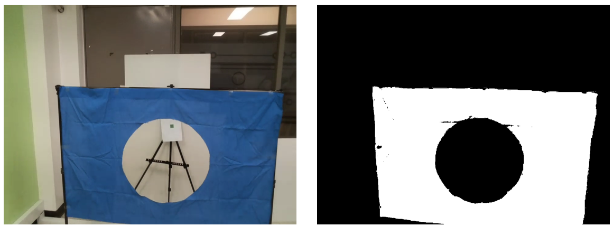

# 1. 대회 진행 전략
* **링 및 표식의 픽셀 수를 이용해 드론 제어:**

    - 1,2,3단계 모두 표식의 **픽셀 수**를 이용해 표식과 드론 사이 거리를 조절한다.

    - 1,2,3단계 모두 상하좌우 각 범위 내의 **픽셀 수 비율**을 이용해 드론의 상하좌우 위치를 조절한다.

    - 2,3단계에서 **천막의 상하좌우 비율**을 맞춘 뒤에 **표식을 탐색**하는 전략으로 정확한 위치조절이 가능하다.

* **링 검출을 위한 드론 이동 전략:**
    - 천막의 상하/좌우 **픽셀 수 비율이 비슷하도록** 드론을 이동시켰다.

    - 2,3단계에서 천막에 너무 가까우면 **후진** 후 다시 탐색하는 전략을 이용했다. 
    
    - 천막이 한 쪽에만 치우쳐있어 픽셀 수 비율이 너무 작으면 **크게 이동**, 적당히 작으면 **작게 이동**하는 방식으로 정확성과 속도를 높혔다.

* **천막이 안보이는 경우 해결 전략:**
    - **`2단계에서 안보이는 경우`:** 드론을 좌우로 **회전**시키며 천막 탐색
    
    - **`3단계에서 안보이는 경우`:** 드론과 천막의 높이차가 커서 안보이는 경우에 대비해, 드론의 **현재 높이를 누적계산**해 높낮이 이동

* **3단계 각도 조절 전략:**
    - 2단계 통과 후 3단계 표식까지의 최적의 경로를 설정하기 위해 각도를 **10도씩** 돌리며 **최적의 각도** 탐색.

    - 드론과 천막 간의 각도가 **0도**일 때가 최적의 각도이며, 이때의 천막 **픽셀 수가 가장 많이 검출**되므로 이를 이용해 각도를 제어한다.

***
# 2. 알고리즘 및 소스코드 설명
## [0단계]

* 코드 실행에 필요한 거리 저장 변수 선언
```matlab
dist_forward = 0.3;       % 대상에 접근하기 위해 전진하는 거리
dist_backward = 0.4;      % 대상을 찾기 위해 후진하는 거리
dist_pass = 1.2;          % 링 통과 후 90도 회전하고 전진하는 거리
Ddist_udlr = 0.2;         % 점 방향으로 이동하기 위한 상하좌우 이동 거리
Rdist_udlr = 0.25;        % 천막 방향으로 이동하기 위한 상하좌우 이동 거리
Rdist_add_forward = 0.5;  % 천막 기준 올바르게 이동한 후 추가적으로 전진하는 거리
height = 1.0;             % 드론의 현재 높이를 저장하는 변수
```

* 드론 객체 선언 → 카메라 객체 선언 → 드론 이륙
```matlab
droneObj = ryze();
cam = camera(droneObj);
takeoff(droneObj);
```

## [1단계]
### ⦁ 드론의 높이와 원의 중심을 일치
원의 중심 높이(1m) - 드론 이륙 기본 높이(0.7m) => 추가 상승 (0.3m)
```matlab
moveup(droneObj,'Distance', 0.3,'WaitUntilDone', true);
```
<p align="center"></p>

### ⦁ 실측 거리를 줄임으로써 이동 시간과 오차 감소
```matlab
moveforward(droneObj, 'Distance', 1.2, 'WaitUntilDone', true);
```
<p align="center"></p>

### ⦁ 초록색 표식을 기준으로 드론의 위치를 제어하는 반복문
> ### 1. 초록색 표식 픽셀 추출 (RGB)
> ```matlab
> frame = snapshot(cam);
> 
> frame = rgb2hsv(frame);
> 
> h = frame(:,:,1); detect_h = (h >= 0.2) & (h <= 0.42);
> s = frame(:,:,2); detect_s = (s >= 0.1) & (s <= 0.76);
> 
> detect_Gdot = detect_h & detect_s;
> 
> canny_img = edge(detect_Gdot, 'Canny', 0.9, 8);
> 
> fill_img = imfill(canny_img, 'holes');
> ```
> 
> 
> ### 2. 초록색 표식의 픽셀 합(green_sum)을 기준으로 드론 이동 제어
> **`[0]`:** 후진 후 다시 초록색 표식 픽셀 추출 코드로 이동
> 
>  
> 
> ```matlab
> if green_sum == 0
>   moveback(droneObj,'Distance', dist_backward,'WaitUntilDone', true);
>   continue;
> ```
> 
> **`[0~300]`:** 위치 이동 없이 직진
> 
> 
> 
> 
> **`[300~2000]`:** detecting 변수 true로 변경
> 
> 
> 
> ```matlab
> elseif green_sum >= 300
>   detecting = true;
> ```
> 
> **`[2000~4000]`:** 표식의 위치가 중앙에 있지 않다면 detecting 변수 true로 변경
> 
> 
> 
> ```matlab
> elseif green_sum >= 2000
>   r_center = sum(sum(detect_Rdot(fix(end/3):fix(end/3 * 2), fix(end/3):fix(end/3 * 2))));
>   if r_center < 2000
>     detecting = true;
>   end
> ```
> 
> **`[4000~]`:** 90° turn → 1.2m 전진 → 반복문 탈출
> 
> 
> 
> ```matlab
> elseif green_sum >= 4000
>   turn(droneObj, deg2rad(90));
>   moveforward(droneObj, 'Distance', dist_pass, 'WaitUntilDone', true);
>   findGreenDot = true;
> ```
> 
>
> ### 3. detecting == true인 경우 드론을 표식 방향으로 이동
> 
> ```matlab
> if (detecting)
>   g_lst = [sum(sum(fill_img(1:fix(end/4*3), 1:end)))   % 상
>            sum(sum(fill_img(fix(end/4):end, 1:end)))   % 하
>            sum(sum(fill_img(1:end, 1:fix(end/3*2))))   % 좌
>            sum(sum(fill_img(1:end, fix(end/3):end)))]; % 우
> ```
> 상하 비율 비교 후 빨간색 픽셀이 더 많은 쪽으로 드론 이동 (좌우 비율 또한 동일한 원리로 작동)
> 
> ```matlab
> if abs(g_lst(1) - g_lst(2)) > 100
>   if g_lst(1) >= g_lst(2) 
>     moveup(droneObj,'Distance', Ddist_udlr,'WaitUntilDone', true);
>   else
>     movedown(droneObj,'Distance', Ddist_udlr,'WaitUntilDone', true);
>   end
> end
> ```
> 
> 
> 
## [2단계]
### ⦁ 천막 픽셀의 상하좌우 비율을 기준으로 드론의 위치를 제어하는 반복문
> ### 1. 파란색 천막 픽셀 추출 (RGB)
> ```matlab
> frame = snapshot(cam);
> 
> r = frame(:,:,1);   detect_r = (r < 50);   
> g = frame(:,:,2);   detect_g = (g > 10) & (g < 120);
> b = frame(:,:,3);   detect_b = (b > 50) & (b < 190);
> 
> detect_Brect = detect_r & detect_g & detect_b;  
> ```
> 
> 
> ### 2. 파란색 천막 픽셀의 합이 100 이하라면 좌우 탐색 후 위치 이동
> 
> 
> **[1]** 정면 기준 -45° turn → sum1 값 저장
> ```matlab
> turn(droneObj, deg2rad(-45));
> frame = snapshot(cam);
> r = frame(:,:,1);   detect_r = (r < 50);   
> g = frame(:,:,2);   detect_g = (g > 10) & (g < 120);
> b = frame(:,:,3);   detect_b = (b > 50) & (b < 190);
> detect_Brect = detect_r & detect_g & detect_b;
> sum1 = sum(sum(detect_Brect));
> ```
> **[2]** 정면 기준 +45° turn → sum2 값 저장
> ```matlab
> turn(droneObj, deg2rad(90));
> frame = snapshot(cam);
> r = frame(:,:,1);   detect_r = (r < 50);   
> g = frame(:,:,2);   detect_g = (g > 10) & (g < 120);
> b = frame(:,:,3);   detect_b = (b > 50) & (b < 190);
> detect_Brect = detect_r & detect_g & detect_b;
> sum2 = sum(sum(detect_Brect));
> ```
> **[3]** sum값이 더 큰 곳으로 0.5m 이동 후 파란색 천막 픽셀 추출 코드로 이동
> ```matlab
> turn(droneObj, deg2rad(-45));
> if sum1 >= sum2
>   moveleft(droneObj, 'Distance', 0.5, 'WaitUntilDone', true);
> else
>   moveright(droneObj, 'Distance', 0.5, 'WaitUntilDone', true);
> end
> continue;
> ```
> ### 3. 파란색 픽셀의 상하좌우 비율 계산
> 
> 
> ```matlab
> B_lst = [sum(sum(detect_Brect(1:fix(end/2), 1:end))) 
>          sum(sum(detect_Brect(fix(end/2):end, 1:end)))
>          sum(sum(detect_Brect(1:end, 1:fix(end/2))))  
>          sum(sum(detect_Brect(1:end, fix(end/2):end)))];
>          
> ratio1 = min(B_lst(1), B_lst(2)) / max(B_lst(1), B_lst(2));    % 상하 비율
> ratio2 = min(B_lst(3), B_lst(4)) / max(B_lst(3), B_lst(4));    % 좌우 비율
> ```
> 
> ### 4. 계산한 비율을 중심으로 드론 이동 제어
> **`[올바른 비율 탐색 성공]`:** 0.4m 하강 → 0.8m 전진 → 반복문 탈출
> ```matlab
> if((ratio1 >= 0.7) && (ratio2 >= 0.7))
>   movedown(droneObj, 'Distance', 0.4, 'WaitUntilDone', true);
>   height = height - 0.4
>   moveforward(droneObj, 'Distance', 0.8, 'WaitUntilDone', true);
>   findRightPos = true;
> ```
> > **`[올바른 비율 탐색 실패]`:**
> > 
> > i) 현재 파란색 천막에 매우 근접한 상황이라면 후진한 후 위의 과정 반복
> > 
> > 
> > 
> > ```matlab
> > b_center = sum(sum(detect_Brect(fix(end/3):fix(end/3 * 2), fix(end/3):fix(end/3 * 2))));
> > if b_center >= 70000
> >   moveback(droneObj,'Distance', dist_backward,'WaitUntilDone', true);
> > ```
> > 
> > ii) 그렇지 않은 경우 파란색 픽셀이 많은 쪽으로 상하/좌우 이동
> >
> > - **`비율이 [~ 0.3]`:** 크게 이동(0.5m)
> >
> > - **`비율이 [0.3 ~ 0.7]`:** 작게 이동(0.25m)
> > 
> > 
> > ```matlab
> > % 상하 이동 코드. (좌우 코드도 동일 방식)
> > if ratio1 < 0.3
> >     if B_lst(1) >= B_lst(2)
> >         moveup(droneObj,'Distance', Rdist_udlr * 2,'WaitUntilDone', true);
> >         height = height + Rdist_udlr * 2
> >     else
> >         movedown(droneObj,'Distance', Rdist_udlr * 2,'WaitUntilDone', true);
> >         height = height - Rdist_udlr * 2
> >     end
> > elseif ratio1 < 0.7
> >     if B_lst(1) >= B_lst(2)
> >         moveup(droneObj,'Distance', Rdist_udlr,'WaitUntilDone', true);
> >         height = height + Rdist_udlr
> >     else
> >         movedown(droneObj,'Distance', Rdist_udlr,'WaitUntilDone', true);
> >         height = height - Rdist_udlr
> >     end
> > end
> > ```
### ⦁ 보라색 표식을 기준으로 드론의 위치를 제어하는 반복문
> ### 1. 보라색 표식 픽셀 추출 (HSV)
> ```matlab
> frame = snapshot(cam);
> frame = rgb2hsv(frame);
> 
> h = frame(:,:,1); detect_h = (h >= 0.69) & (h <= 0.8);
> s = frame(:,:,2); detect_s = (s >= 0.1) & (s <= 0.7);
> 
> detect_Pdot = detect_h & detect_s;
>
> canny_img = edge(detect_Pdot, 'Canny', 0.9, 8);
> 
> fill_img = imfill(canny_img, 'holes');
> ```
> 
> 
> ### 2. 보라색 표식의 픽셀 합(purple_sum)을 기준으로 드론 이동 제어
> **`[0]`:** 후진 후 다시 보라색 표식 픽셀 추출 코드로 이동
> ```matlab
> if purple_sum == 0
>     moveback(droneObj,'Distance', dist_backward,'WaitUntilDone', true);
>     continue;
> ```
> **`[600~4000]`:** detecting 변수 true로 변경
> ```matlab
> elseif purple_sum >= 600
>     detecting = true;
>```
> **`[4000~]`:** 90° turn → 1.2m 전진 → 반복문 탈출
> ```matlab
> elseif purple_sum >= 4000
>     turn(droneObj, deg2rad(90));
>     moveforward(droneObj, 'Distance', dist_pass, 'WaitUntilDone', true);
>     findPurpleDot = true;
> ```
> ### 3. detecting == true인 경우 드론을 표식 방향으로 이동
> 
> 1단계와 동일하게 상하/좌우 비율 비교 후  픽셀이 더 많은 쪽으로 드론 이동

## [3단계]
### ⦁ 드론의 높낮이 조절
천막이 안보이는 경우를 대비해, 드론의 현재 높이(height)가 0.75보다 낮을 경우 위로 이동
```matlab
if height <= 0.75
    moveup(droneObj,'Distance', 0.7,'WaitUntilDone', true);
end
```


### ⦁ 최적 각도 탐색
2단계 통과 후 120° 회전한 상태에서 10°씩 150°까지 회전하면서 각도 비교.

파란색 천막의 픽셀을 가장 많이 검출한 각도가 최적의 각도가 됨.
```matlab
% 10도씩 회전하며 탐색
max_sum = 0;
for index=1:4
    if index > 1
        turn(droneObj, deg2rad(10));
    end

    frame = snapshot(cam);
    r = frame(:,:,1);   detect_r = (r < 50);   
    g = frame(:,:,2);   detect_g = (g > 10) & (g < 120);
    b = frame(:,:,3);   detect_b = (b > 50) & (b < 190);
    detect_Brect = detect_r & detect_g & detect_b;
    sum_blue = sum(sum(detect_Brect));

    if sum_blue > max_sum
        max_sum = sum_blue;
        max_index = index;
    end
end
```
```matlab
% 최적 각도
turn_radi = (-1) * 10 * (4 - max_index);
turn(droneObj, deg2rad(turn_radi));
moveforward(droneObj, 'Distance', 0.4, 'WaitUntilDone', true);
```


### ⦁ 링 및 표식 탐색 코드는 2단계와 동일
빨간색 표식에서 착지
